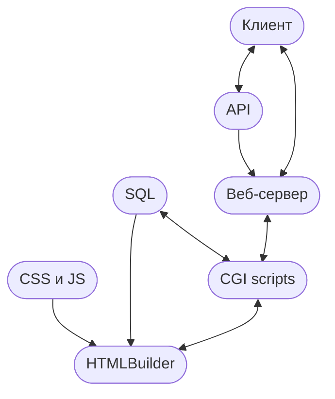

# Web-Server

**Цель:** разработка https-сервера и динамического веб-сайта с использованием языка C++.

**Языки и инструменты:**
<div>
&nbsp;
&nbsp;
&nbsp;
&nbsp;
</div>

**Cхемка**

## Установка
### Windows
#### MinGW Compiler

Для компиляции использовался **[gcc-w64devkit-mingw](https://github.com/skeeto/w64devkit/releases)**<br>
**Example:**` g++ -std=c++20 main.cpp -o main.exe -lWs2_32`

#### MSVC

**Example:**<br>
```
git clone https://github.com/AliceZed8/web-server.git
cd web-server
cmake .
```
<br>

